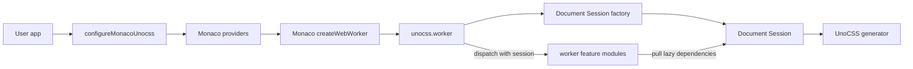
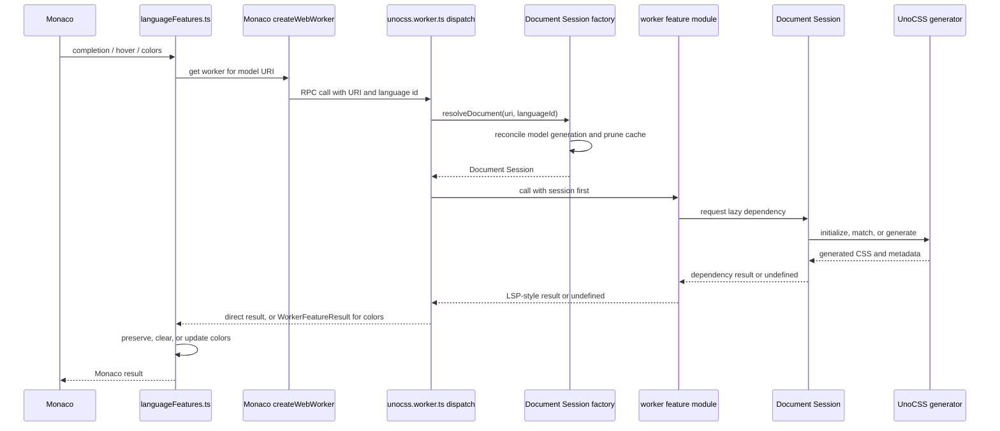

# monaco-unocss

`monaco-unocss` wires UnoCSS into the Monaco editor.

It exposes two entry points:

- `monaco-unocss`: registers Monaco language features through `configureMonacoUnocss`.
- `monaco-unocss/unocss.worker`: initializes the worker that owns UnoCSS generation.

The key split is main thread vs worker. Main-thread code adapts Monaco APIs. Worker code talks to UnoCSS.

## Runtime map

### Main thread

- `src/index.ts` creates the Monaco web worker and registers Monaco providers.
- `src/languageFeatures.ts` converts between Monaco types and LSP-style types from `monaco-languageserver-types`.
- `configureMonacoUnocss()` returns one disposable integration object with:
  - `dispose()`
  - `setUnocssConfig()`
  - `generateStylesFromContent()`

### Worker

- `src/unocss.worker.ts` initializes the worker endpoint.
- The worker creates one Document Session factory from the mirror-model getter and prepared UnoCSS config.
- The factory resolves mirrored Monaco models into `TextDocument`-backed sessions.
- The factory owns the generator initialization result, autocomplete memo, model generations, and matched-positions cache for the worker instance.
- Worker feature modules pull only the lazy dependencies they need from the session.

UnoCSS config can contain functions, presets, rules, shortcuts, and extractors. Keep that logic inside the worker by using `prepareUnocssConfig()`.

## Feature modules

- `src/worker/document-session.ts`: document resolution, lazy UnoCSS dependencies, and matched-position cache lifecycle.
- `src/worker/complete.ts`: utility completion and completion item resolution.
- `src/worker/hover.ts`: hover markdown for matched utilities.
- `src/worker/colors.ts`: document color extraction.
- `src/worker/generate-styles.ts`: CSS generation from arbitrary content.
- `src/worker/prettied-css.ts`: generated CSS formatting for hover and completion docs.
- `src/worker/document-feature-result.ts`: wraps document-level features so failures stay distinct from empty results.
- `src/worker/source-transformers.ts`: minimal plugin context that runs config transformers for style generation.
- `src/worker/utility-candidates.ts`: expands a matched utility into the candidates to generate CSS for.
- `src/worker/presets.ts`: preset presence checks on a generator config.

## Public types

- `src/types/configure.ts` defines the public API.
- `src/types/worker.ts` defines the worker RPC contract.

Keep these files aligned with `src/index.ts`, `src/unocss.worker.ts`, tests, and README examples when changing exported behavior.

## Language support

`defaultLanguageSelector` currently registers providers for:

- `css`
- `javascript`
- `html`
- `mdx`
- `typescript`

## Data flow

## Vendored code

Vendored or adapted logic lives under `src/vendor/*`.

- `constants.ts`
- `defaults-ide.ts`
- `extractor-arbitrary-variants.ts`
- `match-positions.ts`
- `color.ts`
- `css.ts`

Keep upstream attribution intact when touching these files. Avoid mixing copied upstream code directly into `src/worker/*`.

### Upstream alignment policy

This project provides Monaco support; observable behavior should follow upstream UnoCSS.

- Vendored files mirror the upstream commit pinned in their attribution header. Do not land improvements or fixes in `src/vendor/*` directly.
- If vendored logic has a defect, treat it as an upstream defect: report it so the maintainer can fix it in UnoCSS, then re-vendor. Do not fork the behavior locally by default.
- Any deliberate behavior difference from upstream requires explicit consideration and must be recorded in the divergence ledger (`.scratch/upstream-realignment/`), including its motivation and upstream status.
- Monaco-specific needs belong in non-vendored modules layered on top of the vendored mirror, not inside it.

## Tests

Worker behavior is covered in `test/index.test.ts`.
Monaco integration setup is covered in `test/configure.test.ts`.
Public API shape is covered by `test/api.test.ts` snapshots.

The tests use:

- Fake mirror models resolved through the Document Session factory.
- Real UnoCSS configs and generators created by the factory.
- `presetWind3`, `presetWind4`, and `presetAttributify` for feature coverage.
- Direct calls into worker modules with a session or factory as the first argument.
- A new factory per test instead of production-only cache reset hooks.
- `tsnapi` snapshots for public entry points.

Use focused tests for worker behavior before reaching for browser-only verification.

## Commands

Use the package manager pinned by `packageManager` in `package.json`.
pnpm settings and workspace globs live in `pnpm-workspace.yaml`.

- `pnpm build`: build the library with `tsdown`.
- `pnpm test`: build the library, then run Vitest.
- `pnpm typecheck`: type-check the playground and repository sources.
- `pnpm lint`: run ESLint.
- `pnpm play`: run the interactive playground.

For playground integration checks, start it with `pnpm play` and test all three panes in the browser.
For the minimal Vite example, run `pnpm --dir examples/vite dev`.
For production worker bundling checks, run `pnpm --dir examples/vite exec vite build`.

## Release

`pnpm release` runs `bumpp -r`. It recursively updates package manifests and, by default, commits, tags, and pushes the result. A pushed `v*` tag triggers `.github/workflows/release.yml`, which publishes the package.
