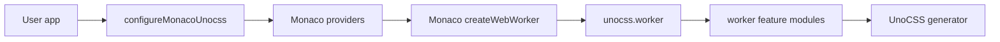
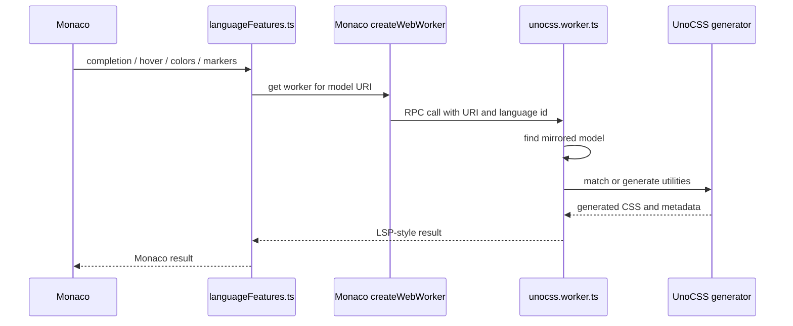

# monaco-unocss

`monaco-unocss` wires UnoCSS into the Monaco editor.

It exposes two entry points:

- `monaco-unocss`: registers Monaco language features through `configureMonacoUnocss`.
- `monaco-unocss/unocss.worker`: initializes the worker that owns UnoCSS generation.

The key split is main thread vs worker. Main-thread code adapts Monaco APIs. Worker code talks to UnoCSS.

## Runtime map

### Main thread

- `src/index.ts` creates the Monaco web worker and registers Monaco providers.
- `src/languageFeatures.ts` converts between Monaco types and LSP-style types from `monaco-languageserver-types`.
- `configureMonacoUnocss()` returns one disposable integration object with:
  - `dispose()`
  - `setUnocssConfig()`
  - `generateStylesFromContent()`

### Worker

- `src/unocss.worker.ts` initializes the worker endpoint.
- The worker builds an UnoCSS generator with `createGenerator()`.
- The worker builds autocomplete with `createAutocomplete()`.
- Mirrored Monaco models are converted to `TextDocument` before worker feature modules run.

UnoCSS config can contain functions, presets, rules, shortcuts, and extractors. Keep that logic inside the worker by using `prepareUnocssConfig()`.

## Feature modules

- `src/worker/complete.ts`: utility completion and completion item resolution.
- `src/worker/hover.ts`: hover markdown for matched utilities.
- `src/worker/validate.ts`: diagnostics for CSS conflicts and blocklisted utilities.
- `src/worker/code-actions.ts`: quick fixes for supported diagnostics.
- `src/worker/colors.ts`: document color extraction.
- `src/worker/generate-styles.ts`: CSS generation from arbitrary content.
- `src/worker/prettied-css.ts`: generated CSS formatting for hover and completion docs.
- `src/worker/matched-positions-cache.ts`: cache for matched utility positions per document URI and content fingerprint.

## Public types

- `src/types/configure.ts` defines the public API.
- `src/types/worker.ts` defines the worker RPC contract.

Keep these files aligned with `src/index.ts`, `src/unocss.worker.ts`, tests, and README examples when changing exported behavior.

## Language support

`defaultLanguageSelector` currently registers providers for:

- `css`
- `javascript`
- `html`
- `mdx`
- `typescript`

Marker data providers are only registered when the language selector item is a string. Monaco has no general matcher for all `languages.LanguageSelector` shapes here.

## Diagnostics

Diagnostics are worker-side and come from `src/worker/validate.ts`.

- `cssConflict`: reports utilities in the same class list that generate the same CSS properties.
- `blocklist`: reports utilities blocked by UnoCSS blocklist rules.

Both are enabled by default and can be disabled through `diagnostics`.

## Data flow

## Vendored code

Vendored or adapted logic lives under `src/vendor/*`.

- `defaults-ide.ts`
- `extractor-arbitrary-variants.ts`
- `match-positions.ts`
- `color.ts`
- `css.ts`

Keep upstream attribution intact when touching these files. Avoid mixing copied upstream code directly into `src/worker/*`.

## Tests

Worker behavior is covered in `test/index.test.ts`.
Monaco integration setup is covered in `test/configure.test.ts`.
Public API shape is covered by `test/api.test.ts` snapshots.

The tests use:

- `TextDocument` fixtures for document content.
- Real UnoCSS generators from `createGenerator()`.
- `presetWind3`, `presetWind4`, and `presetAttributify` for feature coverage.
- Direct calls into worker modules such as `doComplete()`, `doHover()`, `doValidate()`, and `getDocumentColors()`.
- `tsnapi` snapshots for public entry points.

Use focused tests for worker behavior before reaching for browser-only verification.

## Commands

Use the package manager pinned by `packageManager` in `package.json`.
pnpm settings and workspace globs live in `pnpm-workspace.yaml`.

- `pnpm build`: build the library with `tsdown`.
- `pnpm test`: run Vitest.
- `pnpm typecheck`: run `tsc --noEmit`.
- `pnpm lint`: run ESLint.
- `pnpm play`: run the Vite example.

For Monaco integration checks, start the example with `pnpm play` and test the editor in the browser.
For production worker bundling checks, run `pnpm --dir examples/vite exec vite build`.

## Release

`pnpm release` runs `bumpp -r`. It recursively updates package manifests and, by default, commits, tags, and pushes the result. A pushed `v*` tag triggers `.github/workflows/release.yml`, which publishes the package.
